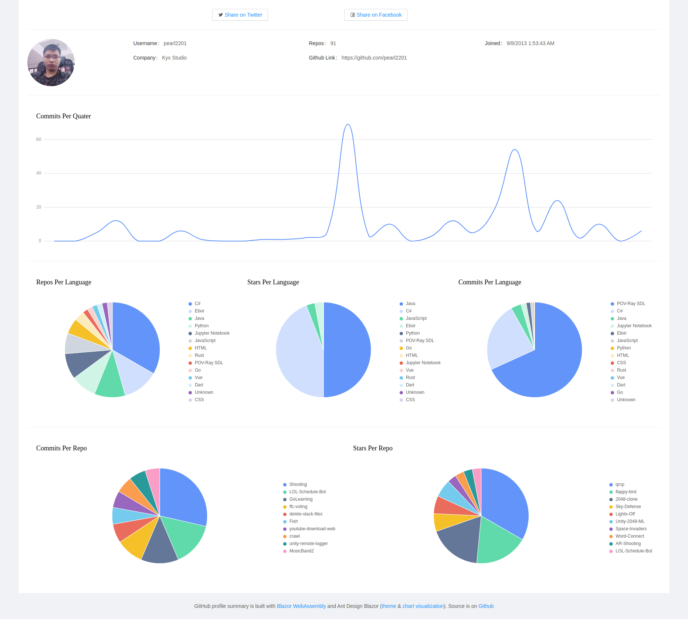

# Github Profile Summary
## Live at: https://pearl2201.github.io/GithubProfileSummary/
## Preview

## Add tokens:
- If no api-token is set, you only get ~50 requests/hour, and if some repos have a large commits, it could lead to take too long time to fetch data. (In some case, it got limited by Github).
- Generate token from: https://github.com/settings/tokens
- Add to file in path: "Services/GithubService.cs"
```csharp
    var token = "add your token here";
    if (string.Equals("token","add your token here"))
    {
        httpClient.DefaultRequestHeaders.Add("Authorization", $"token {token}");
    }
```
## Remote limit 1 fetch request per second.
- Remove line from "Services/GithubService.cs"
```csharp
    await Task.Delay(TimeSpan.FromSeconds(1));
```